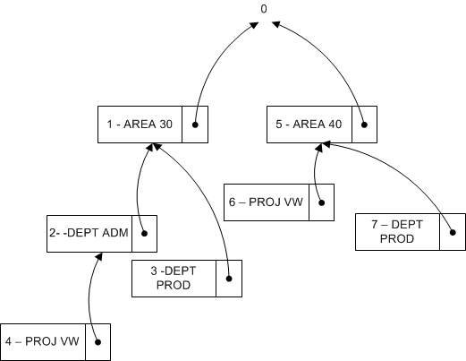

# <a name="design-details-searching-for-dimension-combinations"></a>Dettagli di progettazione: Ricerca delle combinazioni di dimensione
Quando si chiude la finestra dopo avere modificato un set di dimensioni, in [!INCLUDE[d365fin](includes/d365fin_md.md)] viene valutato se il set di dimensioni modificato esiste. Se il set non esiste, viene creato un nuovo set e viene restituito l'ID combinazione delle dimensioni.  

## <a name="building-search-tree"></a>Creazione albero di ricerca  
 La tabella 481 **Nodo albero set di dimensioni** viene utilizzata quando [!INCLUDE[d365fin](includes/d365fin_md.md)] valuta se un set di dimensioni esiste già nella tabella 480 **Voce set di dimensioni**. La valutazione viene eseguita in modo ricorsivo lungo l'albero di ricerca a partire dal livello massimo con numero 0. Il livello massimo 0 rappresenta un set di dimensioni senza movimenti di set di dimensioni. I figli di questo set di dimensioni rappresentano i set di dimensioni con un solo movimento set di dimensioni. I figli di questi set di dimensioni rappresentano i set di dimensioni con due elementi figlio e così via.  

### <a name="example-1"></a>Esempio 1  
 Nel seguente diagramma viene rappresentato un albero di ricerca con sei set di dimensioni. Solo il movimento set di dimensioni distintivo viene visualizzato nel grafico.  

   

 Nella tabella seguente viene descritto un elenco di movimenti set di dimensioni che costituiscono ogni set di dimensioni.  

|Set di dimensioni|Movimenti set di dimensioni|  
|--------------------|---------------------------|  
|Set 0|Nessuno|  
|Set 1|AREA 30|  
|Set 2|AREA 30, REPARTO ADM|  
|Set 3|AREA 30, REPARTO PROD|  
|Set 4|AREA 30, REPARTO ADM, PROJ VW|  
|Set 5|AREA 40|  
|Set 6|AREA 40, PROJ VW|  

### <a name="example-2"></a>Esempio 2  
 In questo esempio viene mostrato in che modo [!INCLUDE[d365fin](includes/d365fin_md.md)] valuta se è presente un set di dimensioni costituito da movimenti di set di dimensioni AREA 40, DEPT PROD.  

 [!INCLUDE[d365fin](includes/d365fin_md.md)] aggiorna prima di tutto anche la tabella **Nodo albero set di dimensioni** per assicurarsi che l'albero di ricerca somigli al diagramma seguente. Pertanto il set di dimensioni 7 diventa un figlio del set di dimensioni 5.  

   

### <a name="finding-dimension-set-id"></a>Ricerca ID set di dimensioni  
 A livello concettuale, i valori **ID padre**, **Dimensione** e **Valore dimensioni**, nell'albero di ricerca vengono combinati e utilizzati come chiave primaria perché [!INCLUDE[d365fin](includes/d365fin_md.md)] attraversa la struttura ad albero nello stesso ordine dei movimenti con dimensione. La funzione Get (record) viene utilizzata per cercare l'ID set di dimensioni. Nell'esempio di codice riportato di seguito viene illustrato come trovare l'ID set di dimensioni quando sono presenti tre valori di dimensione.  

```  
DimSet."Parent ID" := 0;  // 'root'  
IF UserDim.FINDSET THEN  
  REPEAT  
      DimSet.GET(DimSet."Parent ID",UserDim.DimCode,UserDim.DimValueCode);  
  UNTIL UserDim.NEXT = 0;  
EXIT(DimSet.ID);  

```  

 Tuttavia, per mantenere la capacità di [!INCLUDE[d365fin](includes/d365fin_md.md)] di rinominare una dimensione e un valore di dimensione, la tabella 348 **Valore dimensioni** viene estesa con un campo di numero intero di **ID valore dimensioni**. Questa tabella converte la coppia di campi **Dimensione** e **Valore dimensioni** in un valore intero. Quando si rinominano la dimensione e il valore di dimensione, il valore intero non viene modificato.  

```  
DimSet."Parent ID" := 0;  // 'root'  
IF UserDim.FINDSET THEN  
  REPEAT  
      DimSet.GET(DimSet.ParentID,UserDim."Dimension Value ID");  
  UNTIL UserDim.NEXT = 0;  
EXIT(DimSet.ID);  

```  

## <a name="see-also"></a>Vedi anche  
 [Funzione GET (Record)](https://msdn.microsoft.com/en-us/library/dd301056.aspx)    
 [Dettagli di progettazione: Movimenti set di dimensioni](design-details-dimension-set-entries.md)   
 [Sintesi movimenti set di dimensioni](design-details-dimension-set-entries-overview.md)   
 [Dettagli di progettazione: Struttura della tabella](design-details-table-structure.md)   
 [Dettagli di progettazione: Gestione dimensioni della codeunit 408](design-details-codeunit-408-dimension-management.md)   
 [Dettagli di progettazione: Esempi di codice dei modelli modificati nelle modifiche](design-details-code-examples-of-changed-patterns-in-modifications.md)

