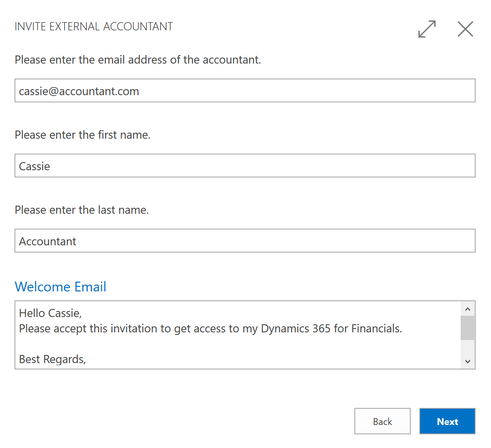

# Invitare il contabile esterno in [!INCLUDE[d365fin](includes/d365fin_md.md)]
Se viene utilizzato un contabile esterno per gestire i libri contabili e i rendiconti finanziari, è possibile invitarlo a [!INCLUDE[d365fin](includes/d365fin_md.md)] in modo che possa utilizzare i dati fiscali dell'azienda.

Dopo che il contabile ha eseguire l'accesso a [!INCLUDE[d365fin](includes/d365fin_md.md)], può utilizzare la Gestione ruolo utente **Contabile** che permette di accedere facilmente alle finestre più pertinenti al suo lavoro.  

## Invitare il contabile in [!INCLUDE[d365fin](includes/d365fin_md.md)]
Nella versione più recente di [!INCLUDE[d365fin](includes/d365fin_md.md)] è stata semplificata la procedura per invitare il contabile esterno. Aprire semplicemente la finestra **Utenti** e scegliere l'azione **Invita contabile esterno** nella barra multifunzione. Viene presentato un messaggio di posta elettronica nel quale è sufficiente aggiungere l'indirizzo di posta elettronica del contabile e inviare l'invito.  

> [!TIP]  
>  È necessario avere impostato il sistema di posta elettronica SMTP. Questa operazione può essere svolta autonomamente oppure è possibile rivolgersi al proprio partner [!INCLUDE[d365fin](includes/d365fin_md.md)]. È inoltre necessario essere connessi a [!INCLUDE[d365fin](includes/d365fin_md.md)] come amministratore utente, non come imprenditore o altri utenti.  

### Licenza separata
Dietro le quinte, il contabile viene aggiunto al tenant di Active Directory in uso. L'amministratore può verificare che il contabile accetti l'invito e gli sia assegnato la licenza corretta. I passaggi da eseguire per questa operazione dipendono dal tipo di conto utilizzato per l'iscrizione a [!INCLUDE[d365fin](includes/d365fin_md.md)]. Questo argomento presuppone l'utilizzo di un account Office 365 che usa Microsoft Azure Active Directory.  

Se è stata attivata la sottoscrizione di [!INCLUDE[d365fin](includes/d365fin_md.md)] e non si utilizza più la società di valutazione, è disponibile un tenant di Azure Active Directory. L'amministratore o il partner [!INCLUDE[d365fin](includes/d365fin_md.md)] gestisce il tenant nel [portale di Azure](https://portal.azure.com). Nel portale è possibile aggiungere nuovi utenti e applicare o rimuovere le licenze. Per ulteriori informazioni, vedere [Panoramica del portale di Microsoft Azure](https://docs.microsoft.com/en-us/azure/azure-portal-overview).  

Uno dei tipi di licenza per [!INCLUDE[d365fin](includes/d365fin_md.md)] è la licenza *Contabile esterno*. Questo tipo di licenza è destinato a utenti quali i contabili esterni. In questo modo non è necessario acquistare una postazione aggiuntiva in Active Directory oppure utilizzare un account utente esistente [!INCLUDE[d365fin](includes/d365fin_md.md)] per il contabile esterno. Ad esempio, se la sottoscrizione corrente di Office 365 include 10 utenti per [!INCLUDE[d365fin](includes/d365fin_md.md)] e attualmente si utilizzano 10 licenze *Utente completo*, l'amministratore può semplicemente aggiungere il contabile esterno come utente guest nel portale di Azure e assegnargli la licenza *Contabile esterno* senza alcun costo aggiuntivo. Tuttavia, è possibile avere un solo utente con la licenza *Contabile esterno*. Se si desidera aggiungere altri utenti, è necessario aggiornare di conseguenza la sottoscrizione di Office 365.  

## Vedi anche
[Finanze](finance.md)  
[Procedura: Impostare la posta elettronica manualmente o tramite il setup assistito](madeira-how-setup-email.md)  
[Esperienze di contabile in Dynamics NAV](finance-accounting.md)  
[Dynamics NAV for Accountants su Microsoft.com](https://www.microsoft.com/en-us/dynamics365/financial-insights-for-accountants)  

